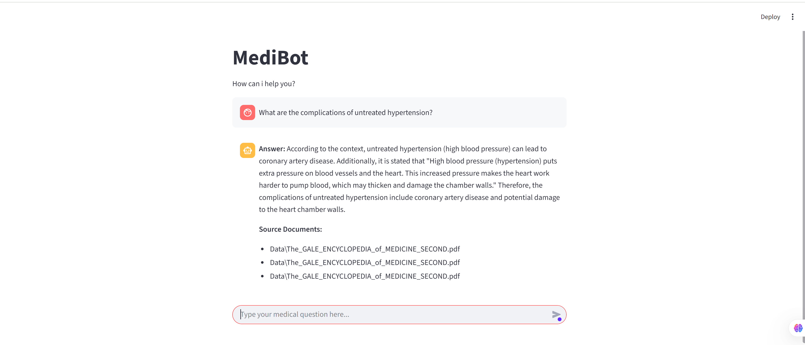

# 🩺 AI Medical Assistant Chatbot

An **AI-powered medical assistant chatbot** built using **Groq LLM**, **LangChain**, **FAISS**, **HuggingFace Embeddings**, and **Streamlit**.  
The bot helps users **search and retrieve medical knowledge** from custom medical documents, providing **accurate and context-aware answers**.

---

## 📽 Demo Video
🎥 **Watch the demo on YouTube:**

> Replace `YOUR_VIDEO_ID_HERE` with your actual YouTube video ID.

---

## 🖼 Bot Screenshot
Here’s how the bot interface looks in action:

> Your screenshot should be saved inside the `assets` folder as **`bot-screenshot.png`**.

---

## 🚀 Features
- 🤖 **AI-powered chatbot** trained on your custom medical PDFs.
- 🧠 **Context-aware responses** using Groq LLM and LangChain.
- ⚡ **Fast document retrieval** powered by FAISS vector database.
- 📚 **HuggingFace embeddings** for text similarity search.
- 🌐 **Streamlit web app** for a clean, easy-to-use interface.
- 🔐 `.env` file support for **secure API key management**.
- 🩺 Useful for **medical students**, **healthcare professionals**, and **researchers**.

---

## 🛠 Tools and Technologies Used

| Category             | Tools / Libraries |
|----------------------|-------------------|
| **Programming Language** | Python 3.10 |
| **IDE** | Visual Studio Code |
| **Frontend / UI** | Streamlit |
| **LLM Provider** | Groq LLM |
| **Framework** | LangChain |
| **Vector Database** | FAISS |
| **Embeddings** | HuggingFace (`sentence-transformers/all-MiniLM-L6-v2`) |
| **Environment Management** | Pipenv / Virtualenv |
| **Version Control** | Git, GitHub Desktop |
| **Data Source** | Custom medical PDFs |

---

## 🧑‍🤝‍🧑 Who Can Benefit From This Project

Medical Students 🧑‍⚕️ – Quickly access reliable knowledge for learning.

Healthcare Professionals 👩‍⚕️ – Use as a reference tool for medical research.

Researchers 🔬 – Summarize and extract useful data from large documents.

AI Enthusiasts 🤖 – Learn how to build and deploy advanced AI-powered bots.

## Data Used

The bot is powered by custom medical PDFs, such as:

The Gale Encyclopedia of Medicine (Second Edition)

## Future Enhancements

✅ Add voice support with speech-to-text integration.

✅ Deploy app to Streamlit Cloud or AWS.

✅ Improve UI with advanced Streamlit components.

✅ Multi-user chat sessions with memory.

## 📜 License

This project is licensed under the MIT License.
See the LICENSE
 file for details.

## 🌟 Acknowledgments

LangChain
 – LLM app framework.

Groq
 – High-performance inference engine.

HuggingFace
 – Embedding models.

Streamlit
 – Web application framework.

FAISS
 – Vector similarity search.

## 📝 Author

Developed by Adeeda Mukhtar

💼 GitHub: https://github.com/adeedamukhtar

🎥 YouTube: https://www.youtube.com/@AdeedaMukhtar/videos
